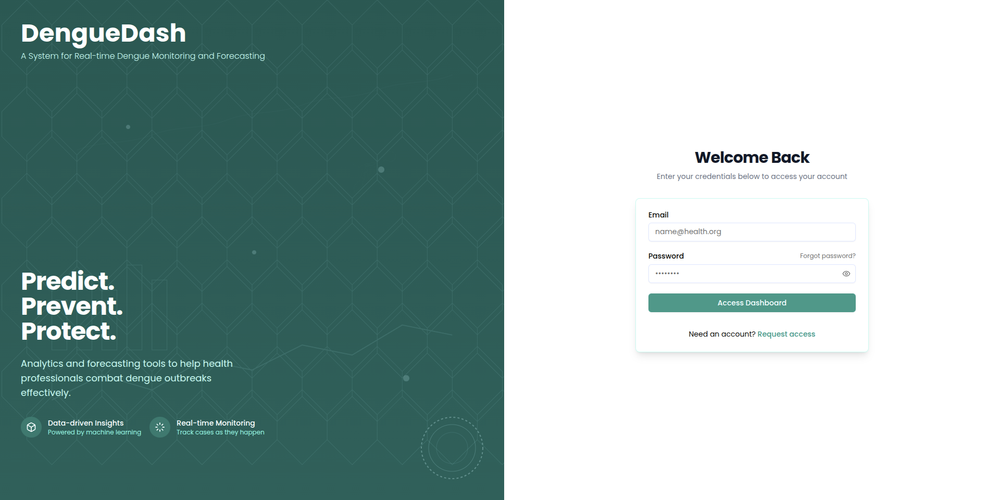
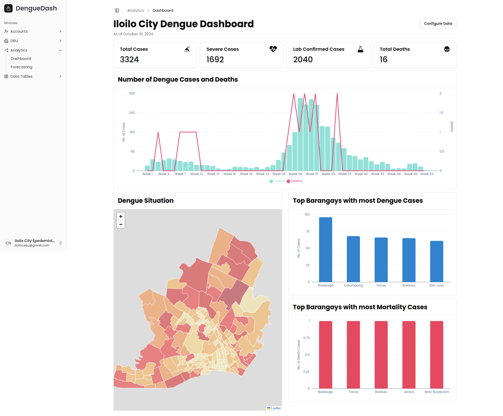
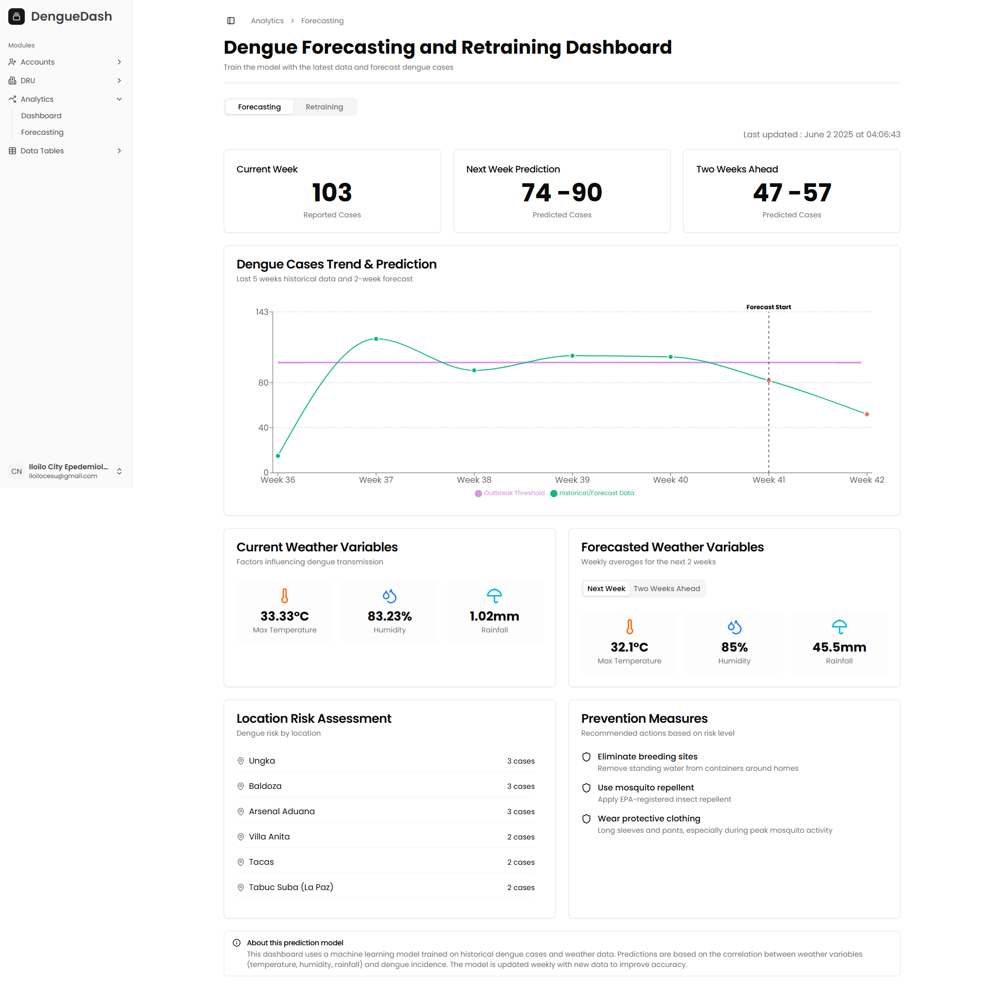
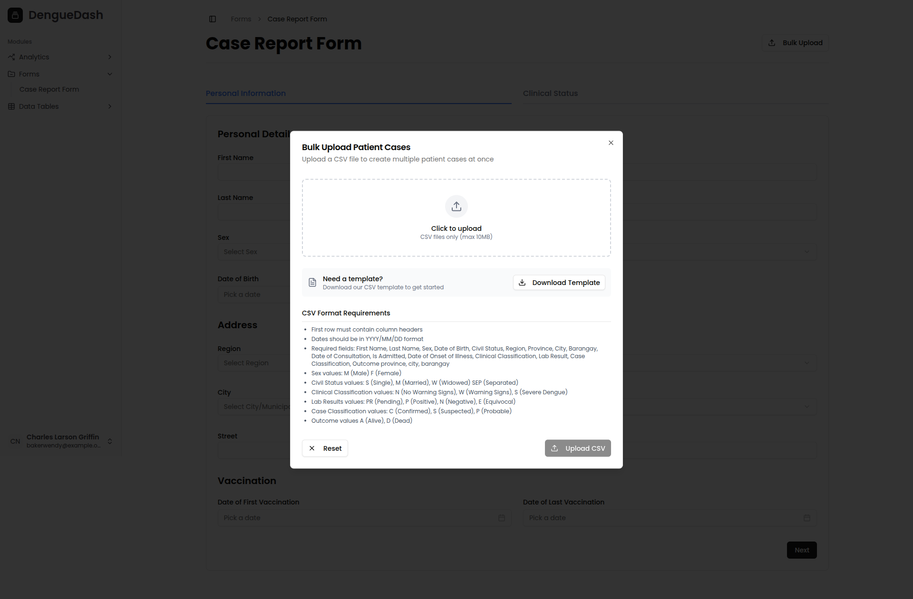

# DengueDash 🦟

A web application for monitoring and forecasting dengue cases in Iloilo City, Philippines. DengueDash combines real-time data visualization with predictive analytics to support public health decision-making.

## 👥 Contributors

- **Kurt Matthew Amodia**
- **Glen Andrew C. Bulaong**
- **Carl Benedict Elipan**

## 📋 Table of Contents

- [Contributors](#contributors)
- [Features](#features)
- [Screenshots](#screenshots)
- [Tech Stack](#tech-stack)
- [Prerequisites](#prerequisites)
- [Installation](#installation)
  - [Backend Setup](#backend-setup)
  - [Frontend Setup](#frontend-setup)
- [Usage](#usage)
- [Project Structure](#project-structure)
- [License](#license)

## ✨ Features

- Real-time dengue case monitoring
- Predictive forecasting using machine learning
- Interactive data visualizations
- User-friendly dashboard interface

## 📸 Screenshots






## 🛠️ Tech Stack

**Frontend:** Next.js 15  
**Backend:** Django  
**Database:** SQLite  
**Containerization:** Docker  
**ML/AI:** TensorFlow with CUDA support

## 📦 Prerequisites

Before you begin, ensure you have the following installed:

- **GPU with CUDA support** (required for TensorFlow)
- **[Python](https://www.python.org/downloads/)** (3.8 or higher recommended)
- **[Node.js](https://nodejs.org/)** (v18 or higher recommended)
- **[Docker Desktop](https://www.docker.com/products/docker-desktop/)**

## 🚀 Installation

### Backend Setup

1. **Navigate to the backend directory:**

   ```bash
   cd app/backend
   ```

2. **Download the database:**

   - Access the database file from [Google Drive](https://drive.google.com/drive/folders/10dIZxSu8B0-3vvuU8fy_ivHPWx0EIsJ6?usp=sharing)
   - Place `db.sqlite3` in the `app/backend` directory

3. **Configure environment variables:**

   Create a `.env` file in the `app/backend` directory:

   ```env
   SECRET_KEY=XzF0KcFHcRh9rng2RVv3D9mwxr6LEoU_tinkRrEu8-A=
   DEBUG=False
   DJANGO_ALLOWED_HOSTS=localhost
   CSRF_TRUSTED_ORIGINS=http://localhost
   ```

   > ⚠️ **Note:** Replace the `SECRET_KEY` with your own secure key for production use.
   > **Hint:** You can generate your `SECRET_KEY` [here](https://jwtsecrets.com/). [Use at least 128 bits].

4. **Build the Docker image:**

   ```bash
   docker-compose build
   ```

5. **Start the backend server:**

   ```bash
   docker-compose up
   ```

   The API will be available at `http://localhost:8000`

6. **Stop the backend server:**
   ```bash
   docker-compose down
   ```

### Frontend Setup

1. **Navigate to the frontend directory:**

   ```bash
   cd app/frontend/denguedash
   ```

2. **Install dependencies:**

   ```bash
   npm install --legacy-peer-deps
   ```

3. **Configure environment variables:**

   Create a `.env` file in the `app/frontend/denguedash` directory:

   ```env
   NEXT_PUBLIC_DJANGO_URL=http://localhost:8000/api/
   JWT_SECRET=XzF0KcFHcRh9rng2RVv3D9mwxr6LEoU_tinkRrEu8-A=
   ```

   > ⚠️ **Note:** Replace the `JWT_SECRET` with your own secure key and ensure it matches the backend `SECRET_KEY`.

4. **Start the development server:**

   ```bash
   npm run dev
   ```

   The application will be available at `http://localhost:3000`

## 💻 Usage

1. Ensure both backend and frontend servers are running
2. Open your browser and navigate to `http://localhost:3000`
3. Explore the dashboard to view current dengue cases and forecasts

## 📁 Project Structure

```
denguedash/
├── app/
│   ├── backend/                 # Django backend API
│   │   ├── docker-compose.yml
│   │   └── db.sqlite3           # Database (download separately)
│   └── frontend/                # Next.js frontend
│       └── denguedash/
├── DengueWatch Final Paper/     # Latex files
├── DengueWatch.pdf              # Approved final paper
└── README.md
```

## 📄 License

This project is part of an academic research. For inquiries about usage and distribution, please contact the contributors.

---

**Note:** This application is designed for research and educational purposes. For production deployment, ensure proper security measures including secure secret keys, environment-specific configurations, and appropriate database solutions.
